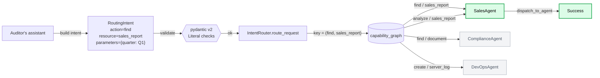
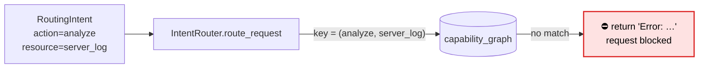

# agent_router

A tiny Python library for **declarative, capability-graph routing** of requests
to agents.

You describe *what* the caller wants as a structured `RoutingIntent`
(`action` + `resource` + `parameters`), and `IntentRouter` looks the pair up in
a capability graph to find the agent that can handle it. Unknown capabilities
are blocked — never silently misrouted.

Built on [pydantic v2](https://docs.pydantic.dev/) for runtime validation.

## Install

```bash
pip install -e ".[dev]"
```

## Quick start

```python
from agent_router import IntentRouter, RoutingIntent

router = IntentRouter()

intent = RoutingIntent(
    action="find",
    resource="sales_report",
    parameters={"quarter": "Q1"},
)

print(router.route_request(intent))
# Routing to SalesAgent with params: {'quarter': 'Q1'}
# -> "Success"
```

## Concepts

### The vocabulary

Two `Literal` type aliases lock down the legal words:

```python
ActionType   = Literal["find", "analyze", "document", "create"]
ResourceType = Literal["sales_report", "server_log", "document"]
```

Any typo (`"finnd"`, `"sales-report"`, …) is rejected by pydantic at
construction time.

### The intent

`RoutingIntent` is a pydantic model with three fields:

| Field        | Type                      | Notes                                       |
|--------------|---------------------------|---------------------------------------------|
| `action`     | `ActionType`              | Required, must be one of the allowed verbs. |
| `resource`   | `ResourceType`            | Required, must be one of the allowed nouns. |
| `parameters` | `dict[str, Any]`          | Free-form payload, defaults to `{}`.        |

### The router

`IntentRouter` holds a `capability_graph` — a dict mapping
`(action, resource)` tuples to agent names:

```python
{
    ("find", "sales_report"):    "SalesAgent",
    ("analyze", "sales_report"): "SalesAgent",
    ("find", "document"):        "ComplianceAgent",
    ("create", "server_log"):    "DevOpsAgent",
}
```

`route_request(intent)`:

1. Builds the key `(intent.action, intent.resource)`.
2. Looks it up in the graph.
3. If **missing** → returns an `"Error: ..."` string (request is blocked).
4. If **found** → calls `dispatch_to_agent(agent_name, intent.parameters)`.

## Walkthrough: an auditor pulls a Q1 sales report

A finance auditor uses an internal assistant to pull Q1 numbers. The assistant
turns the natural-language request into a `RoutingIntent` and hands it to the
router.

```python
from agent_router import IntentRouter, RoutingIntent

router = IntentRouter()

intent = RoutingIntent(
    action="find",
    resource="sales_report",
    parameters={"quarter": "Q1", "year": 2026},
)

router.route_request(intent)
# Routing to SalesAgent with params: {'quarter': 'Q1', 'year': 2026}
# → "Success"
```

### What happens under the hood



The green path is the one this request takes:

1. The assistant packages the user question into a `RoutingIntent`.
2. pydantic checks that `action` and `resource` are in the allowed
   `Literal` vocabularies — garbage in becomes `ValidationError` out.
3. The router builds the tuple key `("find", "sales_report")` and looks it up
   in `capability_graph`.
4. The key resolves to `"SalesAgent"`, so `dispatch_to_agent` forwards the
   agent name plus parameters to whatever concrete implementation you've
   wired in (see *Custom dispatch* below).

### What happens when the capability isn't registered

Same auditor tries to ask for `analyze` on a `server_log`. That edge doesn't
exist in the graph, so the request is blocked instead of being silently
misrouted to the closest-looking agent.

```python
router.route_request(
    RoutingIntent(action="analyze", resource="server_log")
)
# → "Error: No agent exists that can 'analyze' a 'server_log'."
```



This is the core safety property: **every routing decision is an explicit
edge in the graph, or it doesn't happen.**

## Extending

### Custom capability graph

Pass your own graph when constructing the router, or mutate
`router.capability_graph` after the fact:

```python
router = IntentRouter()
router.capability_graph[("analyze", "server_log")] = "DevOpsAgent"
```

### Custom dispatch

Subclass and override `dispatch_to_agent` to plug in real agent logic:

```python
class MyRouter(IntentRouter):
    def dispatch_to_agent(self, agent_name, params):
        agent = AGENT_REGISTRY[agent_name]   # your lookup
        return agent.run(**params)            # your call
```

## Testing

```bash
pytest -q
```

## License

MIT

